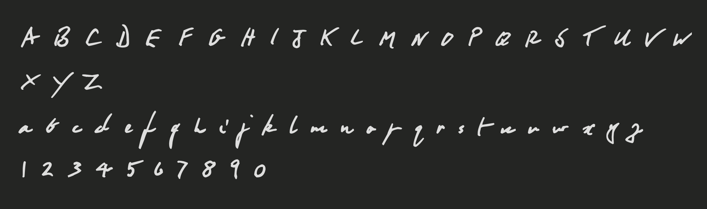

# DevStyle-font
This is a font that resembles Doctor's Handwriting, cna be used by Doctors to send digital prescriptions to patients, or can be used by patients for communicating with their doctors (give them a taste of their medicine, no pun intended), or by anyone to for writing prescriptions as a prank (please don’t do this, not legally advised).

